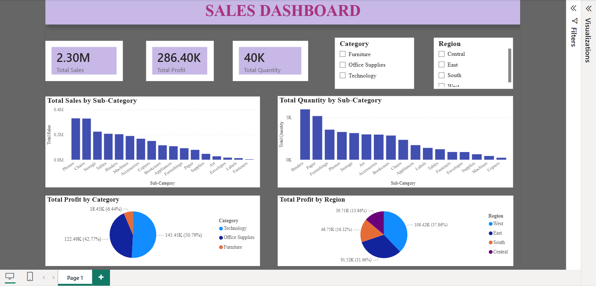
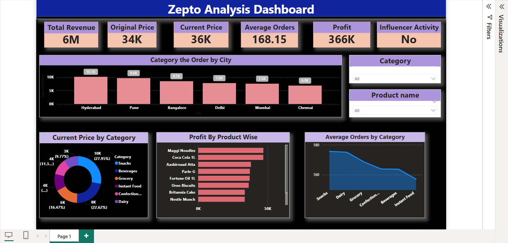
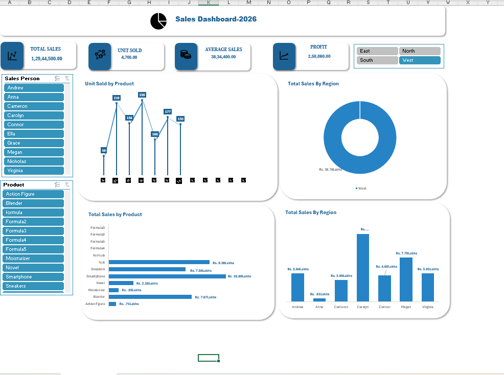

# data-analytics-projects
A collection of data analytics projects built using Power BI and Excel.

## Projects

### 1. Sales Dashboard (Power BI)
- **File:** `sales_dashboard.pbix`
- **Tool:** Power BI
- **Description:** Interactive sales dashboard with KPIs, trends, and regional analysis.
- 

### 2. Zepto Project Report (Power BI)
- **File:** `definition.pbir`
- **Tool:** Power BI
- **Description:** Power BI report connected to the Zepto semantic model.
- 

### 3. Excel Dashboard
- **File:** `Excel_Dashboard_Practice_file.xlsx`
- **Tool:** Microsoft Excel
- **Description:** Practice dashboard built using Excel with charts, pivot tables, and slicers.
- 

## Skills Demonstrated
- Data Visualization
- Dashboard Design
- Power BI (DAX, Data Modeling)
- Microsoft Excel (Pivot Tables, Charts)

## 📬 Contact
https://www.linkedin.com/in/srinithi-vijayaganapathi-376719275

